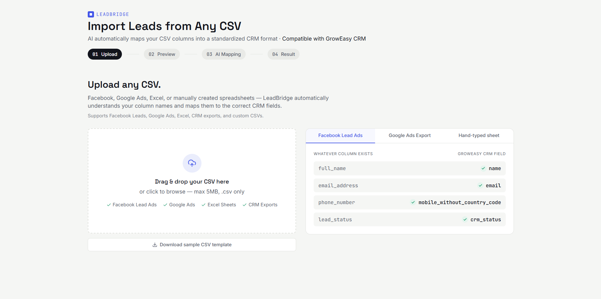
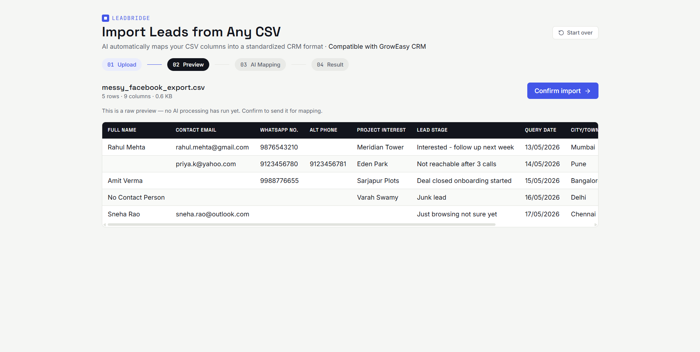
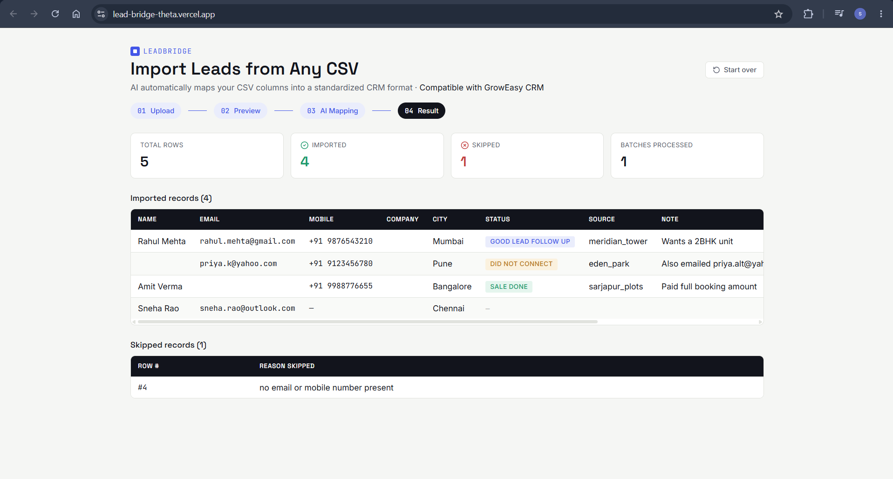

# LeadBridge


**AI-powered CSV lead importer — built for [GrowEasy](https://groweasy.ai)'s Software Developer assignment.**

Upload a CSV from *any* source — Facebook Lead Ads, Google Ads, Excel, another CRM, or a
hand-typed spreadsheet — and LeadBridge maps it into GrowEasy's fixed CRM schema
automatically, regardless of what the original column names are.

Repo: https://github.com/sahilsingh78/LeadBridge

---

## The problem this solves

Every lead source names its columns differently. `full_name` on Facebook, `Contact Name`
on Google Ads, `Client` on a hand-typed sheet — same information, different labels. The
challenge isn't parsing CSVs, it's **understanding** them regardless of shape, then
converting that understanding into a fixed, strictly-validated CRM record.

## How it works

1. **Upload** — drag & drop or pick a `.csv` file.
2. **Preview** — parsed and shown in a table entirely client-side. No AI call happens yet.
3. **Confirm** — clicking Confirm sends the raw CSV to the backend for the first time.
4. **AI Mapping** — the backend batches rows (25/batch) and asks Gemini to map whatever
   columns exist onto the CRM schema, enforcing enum and skip rules via both the prompt
   and a server-side validation layer.
5. **Result** — imported vs. skipped records, with a reason attached to every skip.

## Screenshots

### Upload CSV


### CSV Preview


### AI Parsed Result


## Workflow

```
CSV Upload
      │
      ▼
Client-side Preview
      │
      ▼
Confirm Import
      │
      ▼
Express Backend
      │
      ▼
CSV Parsing
      │
      ▼
Gemini AI Mapping
      │
      ▼
Validation Layer
      │
      ▼
CRM Records
      │
      ▼
Frontend Result Table
```

## Tech stack

| Layer      | Choice                                             |
|------------|-----------------------------------------------------|
| Frontend   | Next.js (App Router) + TypeScript + Tailwind CSS     |
| Backend    | Node.js + Express                                    |
| AI         | Google Gemini (`gemini-2.5-flash`), structured JSON output |
| Testing    | Jest (backend unit tests)                            |

## Project structure

```
LeadBridge/
├── backend/                  Express API
│   ├── src/
│   │   ├── config/            CRM schema/enums + Gemini client setup
│   │   ├── services/          csvParser, promptBuilder, aiExtractor, validator
│   │   ├── routes/            POST /api/import
│   │   ├── middleware/        centralized error handler
│   │   └── server.js
│   ├── src/services/__tests__/  unit tests (parser + validator)
│   ├── .env.example
│   └── Dockerfile
├── frontend/                  Next.js app
│   ├── app/                    page.tsx (4-step flow), layout.tsx, globals.css
│   ├── components/             UploadDropzone, MappingShowcase, DataTable,
│   │                            ProcessingPipeline, StepRail, StatusPill
│   ├── lib/                    csvClientParse, api, sampleTemplate, types
│   ├── .env.local.example
│   └── Dockerfile
├── sample-data/                messy_facebook_export.csv (for testing AI mapping)
└── docker-compose.yml
```

## Running locally

**Prerequisites:** Node.js 18+, and a free Gemini API key from
https://aistudio.google.com/app/apikey

**Backend** (terminal 1):
```bash
cd backend
npm install
cp .env.example .env      # Windows: copy .env.example .env
```
Open `.env` and set `GEMINI_API_KEY=your_key_here`. Then:
```bash
npm run dev
```
Runs on http://localhost:4000

**Frontend** (terminal 2):
```bash
cd frontend
npm install
cp .env.local.example .env.local      # Windows: copy .env.local.example .env.local
npm run dev
```
Runs on http://localhost:3000

**Test it:** upload `sample-data/messy_facebook_export.csv` — a deliberately messy file
with non-standard column names (`WhatsApp No.`, `Alt Phone`, `Query Date`) to exercise
the AI mapping.

### Backend tests
```bash
cd backend
npm test
```

### Docker (both services)
```bash
GEMINI_API_KEY=your_key_here docker compose up --build
```

## CRM extraction rules

The AI extraction layer enforces every rule from the assignment spec:

- `crm_status` restricted to `GOOD_LEAD_FOLLOW_UP`, `DID_NOT_CONNECT`, `BAD_LEAD`,
  `SALE_DONE` — anything else is blanked server-side.
- `data_source` restricted to `leads_on_demand`, `meridian_tower`, `eden_park`,
  `varah_swamy`, `sarjapur_plots` — same safety net.
- `created_at` normalized to a `new Date(...)`-parseable format; unparseable values are
  blanked rather than passed through.
- Multiple emails/phone numbers: first one wins the dedicated field, the rest are
  appended to `crm_note`.
- Rows with neither a usable email nor mobile number are skipped, with a reason.

## Engineering notes

- **Batching + retries** — rows are chunked (`BATCH_SIZE=25`), processed with limited
  concurrency (`BATCH_CONCURRENCY=2`), and each batch retries up to `MAX_RETRIES=3`
  times with exponential backoff. A batch that still fails degrades to "all its rows
  skipped with a reason" rather than failing the whole import.
- **Two-layer validation** — enum constraints and the skip rule are enforced both in the
  Gemini prompt/response schema *and* re-checked independently in `validator.js`, since
  LLM output shouldn't be trusted blindly even with structured output mode.
- **No AI on preview** — the preview table (Step 2) is parsed entirely client-side with
  PapaParse, so it's genuinely zero AI calls until the user confirms, matching the spec.

## Deployment

Live now:
- **Backend (Render)**: https://leadbridge-backend-bf5w.onrender.com — Docker-based web service, root
  directory `backend`, env vars set for `GEMINI_API_KEY`, `GEMINI_MODEL`, batching config, and
  `FRONTEND_ORIGIN` locked to the Vercel domain below.
- **Frontend (Vercel)**: https://lead-bridge-theta.vercel.app/ — root directory `frontend`,
  `NEXT_PUBLIC_API_URL` pointed at the Render backend above.

Note: the Render free tier sleeps after 15 minutes of inactivity, so the first request after
idle time can take 30–50s while it wakes up.

## Submission

- Hosted app: https://lead-bridge-theta.vercel.app/
- Backend API: https://leadbridge-backend-bf5w.onrender.com
- Repo: https://github.com/sahilsingh78/LeadBridge
- Position: Software Developer Intern

## License

MIT
